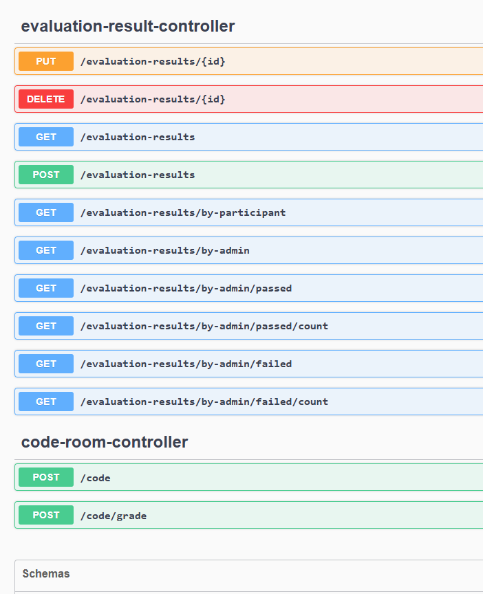

# Code Mirror Service

Un microservicio de Spring Boot diseñado para la colaboración de código en tiempo real, permitiendo a los usuarios crear "salas de código", editar código simultáneamente y, opcionalmente, evaluar la solución final.

## 📜 Descripción

Este servicio es el núcleo de una plataforma de codificación colaborativa. Su principal responsabilidad es gestionar el ciclo de vida de las "salas de código". Cuando se crea una sala, se le asigna un ID único que otros usuarios pueden usar para unirse.

Utilizando **WebSockets**, todos los cambios en el editor de código se transmiten en tiempo real a todos los participantes conectados a la misma sala, creando una experiencia de programación en pareja o en grupo fluida y sincronizada.

Además, el servicio expone un endpoint para enviar el código de una sala a un sistema de evaluación, que devuelve una puntuación y feedback, similar a plataformas como HackerRank.

## ✨ Características Principales

-   **Creación de Salas de Código**: Genera salas únicas y persistentes para programar en un lenguaje específico.
-   **Colaboración en Tiempo Real**: Sincronización instantánea de código a través de WebSockets.
-   **Persistencia de Datos**: Guarda el estado de cada sala de código en una base de datos relacional usando Spring Data JPA.
-   **API RESTful**: Endpoints bien definidos para gestionar el ciclo de vida de las salas (Crear, Leer, Actualizar, Eliminar).
-   **Evaluación de Código**: Funcionalidad para solicitar una evaluación automática del código en una sala.

## 🚀 Stack Tecnológico

-   **Lenguaje**: Java 17+
-   **Framework**: Spring Boot 3.x
-   **API**: Spring Web (MVC)
-   **Tiempo Real**: Spring WebSocket & STOMP
-   **Base de Datos**: Spring Data JPA (compatible con PostgreSQL, H2, MySQL, etc.)
-   **Utilidades**: Lombok
-   **Build Tool**: Maven

## 🔌 API Endpoints (REST)

A continuación se detallan los endpoints REST para interactuar con el servicio.

---

## diagrama de clases

    